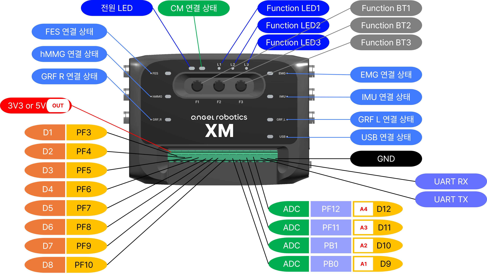

# 외부 GPIO 핀맵 — Rev 2.0

XM10 Rev 2.0 보드의 외부 확장 헤더 핀맵입니다. 디지털 입출력 (DIO) 8 핀 + 아날로그 입력 (ADC) 4 핀이 기본으로 제공되고, DIO 핀은 필요 시 ADC 로 동적 전환해서 최대 12 채널 ADC 까지 확보할 수 있습니다.

> 핀 사용법 (함수 호출) 은 [외부 IO API](../api-reference/04-external-io.md) 참고. 이 페이지는 **보드 핀 배치** 중심입니다.

---

## 헤더 위치

Rev 2.0 보드의 외부 GPIO 헤더 (DIO 8 + ADC 4) 가 보드의 어느 위치에 있는지, 1 번 핀이 어느 방향인지를 위 사진으로 확인하세요. 핀별 기능은 아래 표를 따릅니다.

---

## DIO 8 핀

| API 이름 | PCB 라벨 | 기본 모드 | 비고 |
|----------|---------|---------|------|
| `XM_EXT_DIO_1` | EXT_GPIO_1 | 디지털 | ADC 로 동적 전환 가능 |
| `XM_EXT_DIO_2` | EXT_GPIO_2 | 디지털 | ADC 로 동적 전환 가능 |
| `XM_EXT_DIO_3` | EXT_GPIO_3 | 디지털 | ADC 로 동적 전환 가능 |
| `XM_EXT_DIO_4` | EXT_GPIO_4 | 디지털 | ADC 로 동적 전환 가능 |
| `XM_EXT_DIO_5` | EXT_GPIO_5 | 디지털 | ADC 로 동적 전환 가능 |
| `XM_EXT_DIO_6` | EXT_GPIO_6 | 디지털 | ADC 로 동적 전환 가능 |
| `XM_EXT_DIO_7` | EXT_GPIO_7 | 디지털 | ADC 로 동적 전환 가능 |
| `XM_EXT_DIO_8` | EXT_GPIO_8 | 디지털 | ADC 로 동적 전환 가능 |

**전기 사양**:
- 입력 / 출력: 3.3 V 로직
- 출력 전류: <!-- 사용자가 보드 사양 채움 -->
- 내부 풀업·풀다운 저항: 지원 (`XM_SetPinMode` 로 선택)
- 5 V 호환: <!-- 사용자가 보드 사양 확인 후 채움 -->

> Rev 1.1 과의 커넥터 위치 / 라벨 차이는 보드 외관 사진 참조 (사용자가 추가 예정).

---

## ADC 4 핀 (고정)

| API 이름 | PCB 라벨 | 비고 |
|----------|---------|------|
| `XM_EXT_ADC_1` | EXT_ADC_1 | 16-bit 아날로그 입력 전용 |
| `XM_EXT_ADC_2` | EXT_ADC_2 | 16-bit 아날로그 입력 전용 |
| `XM_EXT_ADC_3` | EXT_ADC_3 | 16-bit 아날로그 입력 전용 |
| `XM_EXT_ADC_4` | EXT_ADC_4 | 16-bit 아날로그 입력 전용 |

**전기 사양**:
- 입력 범위: 0 ~ 3.3 V
- 해상도: 16-bit (네이티브), 함수 출력은 8/10/12/16-bit 선택 가능
- 샘플링: 10 kHz

---

## DIO → ADC 동적 전환 (추가 8 채널)

DIO 핀을 런타임에 ADC 모드로 바꾸면 최대 12 채널 ADC 까지 확보할 수 있어요. `XM_SwitchDioToAdc()` 호출 후 `XM_AnalogRead(XM_DIO_TO_ADC_PIN(dio))` 로 읽습니다.

| 전환 후 API | 원래 DIO |
|------------|---------|
| `XM_EXT_ADC_5` | DIO 1 |
| `XM_EXT_ADC_6` | DIO 2 |
| `XM_EXT_ADC_7` | DIO 3 |
| `XM_EXT_ADC_8` | DIO 4 |
| `XM_EXT_ADC_9` | DIO 5 |
| `XM_EXT_ADC_10` | DIO 6 |
| `XM_EXT_ADC_11` | DIO 7 |
| `XM_EXT_ADC_12` | DIO 8 |

> 전환 후에는 보드 리셋 전까지 ADC 모드로 유지됩니다 (의도된 동작 — 안전 보호).

---

## 외부 IMU 사용 시 주의

외부 IMU (XSENS MTi 등) 를 `XM_EnableExternalImu()` 로 활성화하면 일부 핀이 UART 로 전환됩니다.

<!-- 사용자가 Rev 2.0 의 IMU 활성화 시 점유 핀 정확히 채움 (Rev 1.1 과 다를 수 있음) -->

> 자세한 활성화 방법: [외부 IO API — 외부 IMU 제어](../api-reference/04-external-io.md#35-외부-imu-제어)

---

## 자주 마주치는 상황

| 상황 | 해결 |
|------|------|
| ADC 값이 항상 0 또는 3.3 V 만 나옴 | 풀다운 저항 누락 또는 단락. FSR 분압 회로 (FSR — DIO 핀 — 10 kΩ — GND) 확인 |
| 전환 후 DIO 로 복구 안 됨 | 보드 리셋 또는 전원 재인가 (의도된 안전 동작) |
| `DigitalWrite` 가 무시됨 | 해당 핀이 ADC 모드로 전환된 상태. ADC 핀은 ADC API 로만 사용 |
| ADC 노이즈가 큼 | 짧은 점퍼 + 공통 GND, 필요 시 외부 RC 필터 |

---

## Rev 1.1 과 다른 점

<!-- 사용자가 채울 부분 — 두 보드의 물리적 차이 (커넥터 위치, 핀 배치, 추가 인터페이스 등) -->

| 항목 | Rev 1.1 | Rev 2.0 |
|------|---------|---------|
| 외부 GPIO 커넥터 위치 | (사용자 추가) | (사용자 추가) |
| 핀 배치 순서 | (사용자 추가) | (사용자 추가) |
| 추가 외부 인터페이스 | — | (사용자 확인 후 추가) |

---

## 관련

- 통합 하드웨어 개요: [hardware/README.md](README.md)
- Rev 1.1 핀맵: [external-gpio-rev1.1.md](external-gpio-rev1.1.md)
- 함수 사용법: [외부 IO API](../api-reference/04-external-io.md)
- 실습 예제: [Ex.04 ~ 05d Ext IO 시리즈](../../examples/04_Ext_IO_Basic/)
